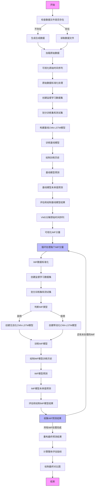

# VMD-CNN-LSTM 时间序列预测

## 项目流程图

```mermaid
graph TD
    A[开始] --> B[检查数据文件是否存在]
    B -->|不存在| C[生成合成数据]
    B -->|存在| D[读取数据文件]
    C --> E[加载原始数据]
    D --> E
    E --> F[可视化原始时间序列]
    
    F --> G[原始数据标准化处理]
    G --> H[创建监督学习数据集]
    H --> I[划分训练集和测试集]
    I --> J[构建基线CNN-LSTM模型]
    J --> K[训练基线模型]
    K --> L[绘制训练历史]
    L --> M[基线模型预测]
    M --> N[基线模型未来值预测]
    N --> O[评估和绘制基线模型结果]
    
    O --> P[VMD分解原始时间序列]
    P --> Q[可视化IMF分量]
    Q --> R[循环处理每个IMF分量]
    
    R --> S[IMF数据标准化]
    S --> T[创建监督学习数据集]
    T --> U[划分训练集和测试集]
    U --> V[判断IMF类型]
    V -->|高频| W[创建无池化CNN-LSTM模型]
    V -->|低频| X[创建带池化CNN-LSTM模型]
    W --> Y[训练IMF模型]
    X --> Y
    Y --> Z[绘制IMF模型训练历史]
    Z --> AA[IMF模型预测]
    AA --> AB[IMF模型未来值预测]
    AB --> AC[评估和绘制IMF模型结果]
    AC --> AD[收集IMF预测结果]
    AD -->|还有未处理的IMF| R
    AD -->|所有IMF处理完成| AE[重构最终预测结果]
    
    AE --> AF[计算整体评估指标]
    AF --> AG[绘制最终对比图]
    AG --> AH[结束]
    
    style A fill:#f9f,stroke:#333
    style AH fill:#f9f,stroke:#333
    style R fill:#bbf,stroke:#333
    style AD fill:#bbf,stroke:#333
```

## 安装依赖
python -m pip install -r requirements.txt

## 运行
python src/main.py

如果没有 data/sample_data.csv，脚本会自动生成合成数据。
